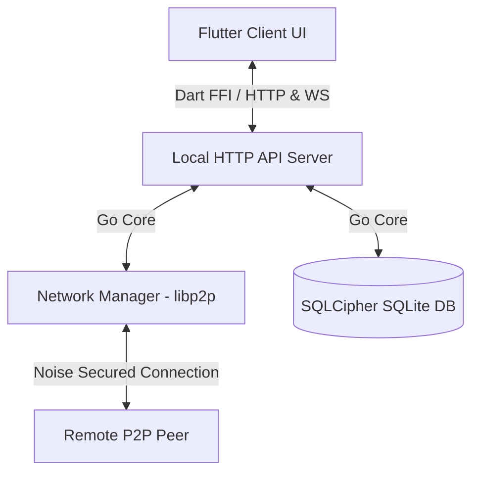

# Torbi Messenger 🔐

**Torbi** — это децентрализованный мессенджер с открытым исходным кодом, работающий по принципу **Peer-to-Peer (P2P)** без выделенных центральных серверов. Безопасность сообщений обеспечивается сквозным шифрованием (E2EE) по умолчанию, а репликация истории построена по принципу защищенной «черной коробки».

Проект состоит из двух основных частей:
1. **Core Engine (Go)** — криптографическое и сетевое ядро, собираемое в виде динамической библиотеки (`torbi.dll` / `libtorbi.so`) для интеграции через Dart FFI.
2. **Client UI (Flutter)** — премиальный кроссплатформенный клиент, поддерживающий сборку под Windows и Android.

---

## Ключевые особенности

* **Полная децентрализация (P2P)**: Работает на базе протокола `go-libp2p`. Узлы напрямую соединяются друг с другом. Автоматическое обнаружение устройств в локальной сети по Wi-Fi (mDNS) и глобальный обход NAT (Hole Punching / AutoNAT / UPnP).
* **Сквозное шифрование (E2EE) по умолчанию**: Обмен ключами происходит по протоколу Диффи-Хеллмана на эллиптических кривых (ECDH X25519), а шифрование сообщений выполняется алгоритмом аутентифицированного шифрования **ChaCha20-Poly1305 (AEAD)**.
* **Защищенная локальная база данных ("черная коробка")**: Локальная история сообщений хранится в SQLite, зашифрованном на уровне диска с помощью **SQLCipher (AES-256)**. Ключ БД генерируется случайным образом и надежно хранится в аппаратном хранилище ОС (`FlutterSecureStorage` / Keychain / Keystore).
* **Синхронизация истории без потерь**: Двусторонний 3-шаговый протокол синхронизации на базе сверки множеств (Set Difference) находит и догружает недостающие сообщения (даже при наличии пропусков в сети), упорядочивая их по логическим часам Лампорта.

---

## Архитектура проекта



---

## Быстрый старт (Разработка)

### Сборка под Windows
1. Скомпилируйте Go-ядро:
   ```bash
   # Используйте окружение MSYS2 UCRT64
   go build -o torbi.exe
   ```
2. Запустите Flutter-клиент:
   ```bash
   cd client
   flutter run -d windows
   ```

### Сборка под Android
1. Установите Android SDK и NDK.
2. Скомпилируйте Go-движок для Android:
   ```bash
   build_android.bat
   ```
3. Запустите установку на телефон:
   ```bash
   cd client
   flutter run -d android
   ```

---

## Интеграционное тестирование
В корне проекта находится Python-скрипт автотестирования `verify_messenger.py`. Он полностью автоматизирует:
1. Запуск двух независимых узлов мессенджера на портах `11001` и `11002`.
2. Соединение и отправку E2EE сообщений в реальном времени.
3. Проверку непробиваемости базы данных без ключа SQLCipher.
4. Отключение одного узла, отправку офлайн-сообщений и проверку их автоматического восстановления (репликации) при повторном включении.

Для запуска тестов выполните:
```bash
python verify_messenger.py
```
