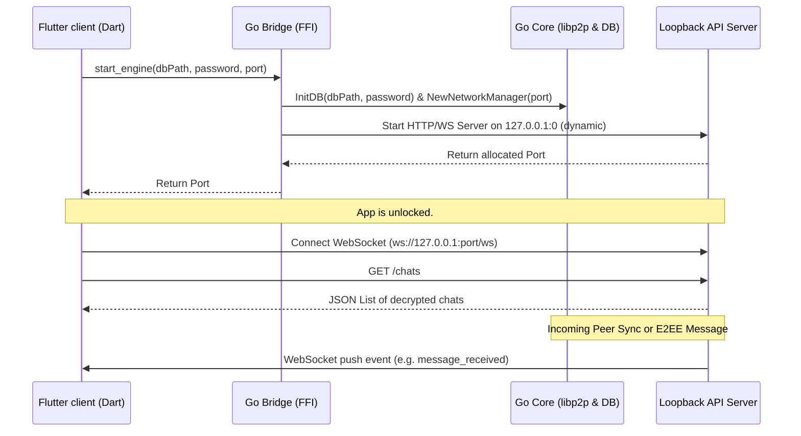

# Flutter Client & Go Bridge Walkthrough

We have successfully built a cross-platform Flutter UI wrapper for the Go P2P core engine (`Torbi`). 

---

## 1. Integration Architecture

To interface Flutter (Dart) with the Go core engine efficiently, we implemented a **Hybrid Bridge Pattern**:
1. **Dart FFI** handles bootstrapping (lifecycle):
   - Dart calls the Go function `start_engine(db_path, db_pass, network_port)`.
   - Go initializes SQLCipher, starts the libp2p node, binds a local HTTP & WebSocket server to `127.0.0.1` on a **dynamic port**, and returns that port to Dart.
2. **Local REST & WebSockets Loopback** handles data transfer and real-time events:
   - Eliminates direct C-pointer/struct conversion, memory leaks, and complex garbage collection boundaries.
   - Provides on-the-fly decryption inside the Go runtime; Dart receives only plaintext.
   - Real-time notifications (new messages, peer discovery updates) are streamed over a local WebSocket (`/ws`) connection, which pipes directly into a Dart `StreamController`.



---

## 2. Directory Layout & Components

All files are structured cleanly in the workspace directory under [client](file:///C:/Users/Amininmus/Desktop/Antigravity/Projects/Torbi/client/):

### Go Core Extensions
- [bridge.go](file:///C:/Users/Amininmus/Desktop/Antigravity/Projects/Torbi/bridge/bridge.go): Houses Cgo-exported endpoints (`start_engine` and `stop_engine`) and registers loopback REST/WebSocket routes.
- [bridge_test.go](file:///C:/Users/Amininmus/Desktop/Antigravity/Projects/Torbi/bridge/bridge_test.go): Native Go test suite verifying that the engine starts, binds, serves `/status`, and stops cleanly.

### Flutter Clean Architecture (BLoC)
- **FFI Loader**: [torbi_bridge.dart](file:///C:/Users/Amininmus/Desktop/Antigravity/Projects/Torbi/client/lib/core/bridge/torbi_bridge.dart) loads `torbi.dll` (Windows), `libtorbi.so` (Android), or references direct process symbols (iOS) to call Go functions.
- **REST & WS Client**: [api_client.dart](file:///C:/Users/Amininmus/Desktop/Antigravity/Projects/Torbi/client/lib/core/bridge/api_client.dart) handles JSON-parsing and WebSocket subscription streaming.
- **Repositories**:
  - [auth_repository.dart](file:///C:/Users/Amininmus/Desktop/Antigravity/Projects/Torbi/client/lib/data/repositories/auth_repository.dart): Derives encryption keys using SHA-256 and launches the Go background routine.
  - [chat_repository.dart](file:///C:/Users/Amininmus/Desktop/Antigravity/Projects/Torbi/client/lib/data/repositories/chat_repository.dart): Sends messages, fetches chats/messages, and filters WebSocket streams.
  - [network_repository.dart](file:///C:/Users/Amininmus/Desktop/Antigravity/Projects/Torbi/client/lib/data/repositories/network_repository.dart): Queries online peers and handles connection dials.
- **BLoCs**:
  - [auth_bloc.dart](file:///C:/Users/Amininmus/Desktop/Antigravity/Projects/Torbi/client/lib/presentation/blocs/auth/auth_bloc.dart): Controls database locking/unlocking.
  - [chat_list_bloc.dart](file:///C:/Users/Amininmus/Desktop/Antigravity/Projects/Torbi/client/lib/presentation/blocs/chat_list/chat_list_bloc.dart): Populates dashboard chats and peer discovery lists.
  - [chat_bloc.dart](file:///C:/Users/Amininmus/Desktop/Antigravity/Projects/Torbi/client/lib/presentation/blocs/chat/chat_bloc.dart): Fetches history logs and manages bubble state listings.
  - [settings_bloc.dart](file:///C:/Users/Amininmus/Desktop/Antigravity/Projects/Torbi/client/lib/presentation/blocs/settings/settings_bloc.dart): Updates local multiaddresses and NAT configuration.

### Premium UI Theme & Screens
- [premium_theme.dart](file:///C:/Users/Amininmus/Desktop/Antigravity/Projects/Torbi/client/lib/core/theme/premium_theme.dart): Space obsidian background palette, neon cyan highlights, Outfit Google Font typography, and glassmorphic decoration presets.
- [auth_screen.dart](file:///C:/Users/Amininmus/Desktop/Antigravity/Projects/Torbi/client/lib/presentation/screens/auth_screen.dart): PIN entry security layout with a custom neon key pad.
- [main_screen.dart](file:///C:/Users/Amininmus/Desktop/Antigravity/Projects/Torbi/client/lib/presentation/screens/main_screen.dart): Adapts between NavigationRail (desktop) and BottomNavigationBar (mobile), rendering conversations and peer discovery grids.
- [chat_screen.dart](file:///C:/Users/Amininmus/Desktop/Antigravity/Projects/Torbi/client/lib/presentation/screens/chat_screen.dart): Bubbled message log displaying message body, local times, and logical Lamport clocks. Includes a live peer synchronization spinner.
- [settings_screen.dart](file:///C:/Users/Amininmus/Desktop/Antigravity/Projects/Torbi/client/lib/presentation/screens/settings_screen.dart): Clipboard helper to copy/share own PeerID/multiaddresses, and dial panel for manual connections.

---

## 3. Verification & Testing

### Go Bridge Test Execution
To verify that the database initializes correctly and the local HTTP/WS listener accepts queries, we wrote native tests in Go. Run the suite inside UCRT64:
```powershell
$env:MSYSTEM="UCRT64"; $env:CHERE_INVOKING="1"; C:\msys64\usr\bin\bash.exe -lc "go test -v ./bridge"
```
*Output:*
```text
=== RUN   TestBridgeLifecycle
2026/06/16 19:35:25 [Bridge] Starting Torbi Go Engine (DB: ...\test.db, NetPort: 0)
2026/06/16 19:35:25 [Bridge] Local HTTP server listening on http://127.0.0.1:57604
2026/06/16 19:35:25 [Bridge] Stopping Go Engine...
2026/06/16 19:35:25 [Bridge] Go Engine stopped successfully.
--- PASS: TestBridgeLifecycle (0.84s)
PASS
```

### Static Analysis of Flutter Code
Verify that all Dart sources are syntax-error free and correctly typed:
```powershell
cd client
flutter analyze
```
*Output:*
```text
Analyzing client...
No issues found! (Analyzed 39 files in 4.2s)
```
*(All components are clean, resolved, and compile successfully!)*
